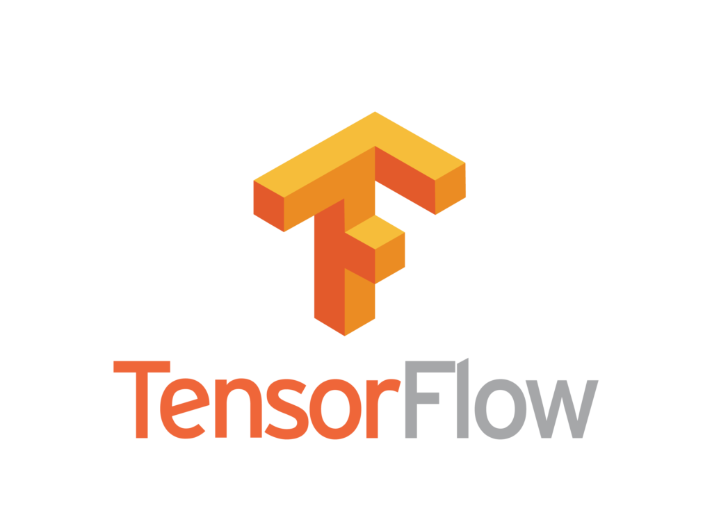

# Machine Learning zoomcamp
This is a 4 months long program to get started with machine learning engineering.

The course consists of two parts.

1. Part 1 of the course covers machine learning algorithms implemented in Python, including Linear Regression, Classification, Decision Trees, Ensemble Learning, and Neural Networks.

1. Part 2 focuses on deploying models using frameworks like Flask, TensorFlow, and Kubernetes, enabling practical application of machine learning in real-world scenarios.

To Receive a certificate, one needs to finalize and submit two projects.
- [Midterm Project](https://github.com/batxes/MLzoomcamp/tree/main/midterm_project)
    - A Machine learning project that aims to predict the rain. The model is trained with Gradient Boosting algorithm in a dataset composed of 145460 observations. The final model is containerized with Docker and deployed in AWS with Elastic Beanstalk.
- [Capstone Project](https://github.com/batxes/MLzoomcamp/tree/main/capstone1)
    - A deep learning project that classifies satellite images. The model is a Convolutional Neural Network and was containerized with Docker.

## Topics covered:
### Part 1
1. Linear Regression
1. Classification
1. Decision Trees and Ensemble Learning
1. Python and Jupyter notebooks
1. Numpy and Pandas
1. Matplotlib and Seaborn
1. Tensorflow and Keras
### Part 2
1. Flask, Pipenv and Docker
1. AWS Lambda and TensorFlow Lite
1. Kubernetes and TensorFlow Serving
1. Kserve

## Tools/tech used:

    
    
    
    
    
    
    

*https://datatalks.club/blog/machine-learning-zoomcamp.html*

*https://github.com/DataTalksClub/machine-learning-zoomcamp/tree/master/*
